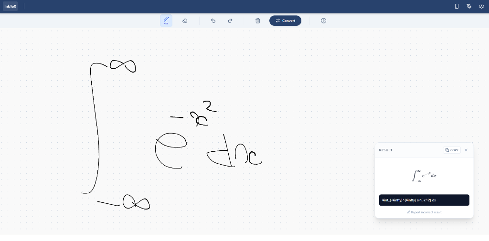

# InkTeX　（※現在はAPIキーを設定していないため使用できません）



InkTeXは、Next.jsとGoogle Gemini APIを使用した、AI搭載の手書き数式 to LaTeX変換ツールです。
デバイス連携機能を備えており、スマホやタブレットをPCのペンタブレット代わりに使用することができます。

## 主な機能

- **AIによる高精度変換**: 手書きの数式をGoogle Geminiモデル（デフォルト: `gemini-2.5`）を使用してLaTeX形式に変換します。
- **デバイス連携モード (Device Sync)**:
  - **ホスト (PC)**: QRコードを表示してセッションを作成します。
  - **クライアント (スマホ/タブレット)**: QRコードを読み取ることで、手元の端末を入力デバイスとして使用できます。
  - **リアルタイム連携**: クライアントで描いた線がホスト側に送信され、変換を実行できます。
- **キャリブレーション & フィードバックループ**:
  - **キャリブレーション**: 自分の筆跡（特定の記号や数式）を登録することで、AIの認識精度を向上させます（プロンプトコンテキストによるワンショット学習）。
  - **フィードバック機能**: 変換結果が間違っていた場合、その場で正しいLaTeXを入力して修正・保存することで、次回の認識精度を改善します。
- **レスポンシブデザイン**: Tailwind CSSによるモダンで使いやすいUI。

## 始め方

### 必須環境

- Node.js 18以上
- Google Gemini APIキー

### インストール手順

1. リポジトリをクローンします:
   ```bash
   git clone https://github.com/honmayuto02/inktex.git
   cd inktex
   ```

2. 依存パッケージをインストールします:
   ```bash
   npm install
   ```

3. 環境変数を設定します:
   `.env.local.example` をコピーして `.env.local` を作成し、APIキーを設定します。
   ```bash
   cp .env.local.example .env.local
   ```
   `.env.local` を編集:
   ```env
   GEMINI_API_KEY=あなたのAPIキー
   ```

4. 開発サーバーを起動します:
   ```bash
   npm run dev
   ```

5. ブラウザで [http://localhost:3000](http://localhost:3000) を開きます。

## 使用技術

- **フレームワーク**: Next.js 15 (App Router)
- **AI**: Google Gemini API (`gemini-2.5`)
- **スタイリング**: Tailwind CSS
- **数式レンダリング**: KaTeX
